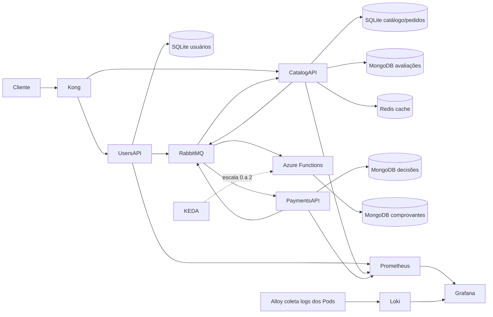

# FIAP Cloud Games — Fase 3

Ambiente de estudo local, sem conta Azure/AWS/Google e sem serviços pagos. O ponto de entrada das APIs é o Kong. A função usa o runtime real do Azure Functions em Kubernetes com KEDA; ela pode ficar com zero instâncias quando não existem mensagens.

**Estado:** implantação local validada em 11/09/2026: gateway, compras aprovadas/rejeitadas, MongoDB, Redis, métricas, logs e função acionada por fila com retorno a zero. Há 17 testes automatizados aprovados. Consulte docs/VALIDACAO.md para as evidências e os limites.

## Começar pelo caminho mais simples

1. Abra **Docker Desktop** e aguarde o mecanismo de **Linux containers** ficar pronto.
2. Mantenha as pastas dos repositórios lado a lado, como estão neste workspace.
3. Abra PowerShell nesta pasta e execute:

```powershell
.\scripts\Start-Kubernetes.ps1
```

O script gera credenciais locais, baixa kind e kubectl com verificação de checksum, cria o cluster isolado `fcg-fase3` dentro do Docker, compila as imagens, instala KEDA e aplica os manifestos. Não precisa ativar o Kubernetes do Docker Desktop. A primeira execução baixa várias imagens e pode levar alguns minutos.

Se o Docker não estiver no PATH:

```powershell
.\scripts\Start-Kubernetes.ps1 -DockerPath 'C:\caminho\para\docker.exe'
```

Pré-requisitos: Windows x64, PowerShell, Docker com Linux containers e acesso à internet para os downloads. Planeje cerca de 8 GB de memória disponíveis para Docker e espaço para imagens; ajuste conforme os recursos da máquina. O .NET SDK local é necessário apenas para executar os testes fora dos containers.

O script usa kubeconfig em `.local/kubeconfig` e contexto explícito `kind-fcg-fase3`, evitando alterar um cluster remoto. O ambiente cria bancos de demonstração próprios; não migra automaticamente dados do monólito ou de volumes antigos da Fase 2.

## Onde abrir

| Serviço | Endereço | Acesso |
|---|---|---|
| API pelo Kong | http://localhost:8000 | Login e JWT nas rotas protegidas |
| Grafana | http://localhost:3000 | Usuário `admin`; senha `GRAFANA_PASSWORD` do arquivo local `.env` |
| Prometheus | http://localhost:9090 | Consulta local |
| RabbitMQ Management | http://localhost:15672 | Usuário `fcg`; senha `RABBIT_PASSWORD` do `.env` |

As portas ficam vinculadas a 127.0.0.1. UsersAPI, CatalogAPI e PaymentsAPI não têm portas de negócio publicadas diretamente. MongoDB, Redis e a função também não são publicados no host.

As credenciais da conta inicial da aplicação são `ADMIN_EMAIL` e `ADMIN_PASSWORD` em `.env`. Ela é criada **somente se o banco de usuários estiver vazio**. Cadastro público não permite criar administrador. Não publique `.env`, `.local/` nem prints de suas senhas. O script preserva a configuração existente em novas execuções.

## Testar o ambiente

```powershell
.\scripts\Test-Flow.ps1
.\scripts\Test-Observability.ps1
.\scripts\Test-Serverless.ps1
```

- **Test-Flow:** verifica rejeição de token ausente/inválido, bloqueio de administrador no cadastro, autorização, compra com desconto, atualização da biblioteca, gravação/alteração no MongoDB e MISS/HIT/invalidação no Redis.
- **Test-Observability:** verifica os três alvos Prometheus e os logs das duas notificações no Loki, por meio do Grafana.
- **Test-Serverless:** confirma os logs da execução e aguarda o Deployment da função voltar a zero. Execute o fluxo novamente para observar a reativação.
- **Test-Rejection:** testa pagamento rejeitado e notificações; restaura a configuração de aprovação ao terminar.
- **Test-Recovery:** interrompe Redis temporariamente e recria MongoDB/Users/Catalog para verificar a recuperação dos dados.
- **Test-BrokerPersistence:** usa uma fila temporária para verificar que uma mensagem persiste após recriar RabbitMQ.

Resultados do fluxo e IDs ficam em `.local/last-test.json`, sem tokens ou senhas. Se um comando falhar, o script para e informa o motivo. Não é necessário fazer cadastro manual de dados para executar o roteiro.

Para assistir aos Pods durante a demonstração, em outro terminal:

```powershell
.\.local\tools\kubectl.exe --kubeconfig .\.local\kubeconfig -n fiap-cloud-games get pods -w
```

## Arquitetura escolhida



### As cinco exigências

| Exigência | Implementação |
|---|---|
| Gateway | Kong sem banco, rotas e política JWT em `gateway/kong.template.yml`. As APIs também validam emissor, audiência e validade. |
| Serverless | Azure Functions isolated .NET 8, trigger RabbitMQ, KEDA com mínimo zero. Código e IaC no repositório `FIAP-NotificationsFunction`. |
| Observabilidade (opção A) | prometheus-net nas APIs; Prometheus e Grafana por manifestos Kubernetes. Loki + Alloy centralizam os logs, incluindo os da função. |
| NoSQL | Driver oficial MongoDB.Driver: avaliações com comentário e tags; decisões de pagamento e comprovantes de notificação em bases separadas. |
| Cache | Redis via IDistributedCache: primeira página das avaliações por jogo; TTL absoluto de 30 segundos e invalidação na escrita. |

No Grafana, abra **Dashboards → FCG → FCG - Fase 3**. Há painéis de latência p95, requisições por segundo, total por status, erros 5xx, cache e logs das notificações. A opção A não exige traces distribuídos; esta implementação não afirma coletá-los.

## Docker Compose para desenvolvimento

```powershell
.\scripts\Start-Compose.ps1
# Ao terminar ou antes de mudar para Kubernetes:
.\scripts\Stop-Compose.ps1
```

O Compose usa os mesmos endereços, a função e as integrações, mas **mantém a função em execução: não demonstra escala a zero**. Para o vídeo da Fase 3, use Kubernetes com KEDA. Não execute ambos ao mesmo tempo nas mesmas portas. Os bancos de Compose e Kubernetes são independentes.

Stop-Compose preserva os volumes. Parar e iniciar Docker preserva o cluster kind e seus dados. Excluir o cluster kind elimina seus volumes; não faça isso se precisar manter os registros. SQLite usa uma réplica por serviço e PVC, com estratégia Recreate. Esta é uma implantação local didática, não uma arquitetura de alta disponibilidade.

## Estrutura e documentos

- `k8s/`: aplicações, bancos, gateway e monitoramento.
- `kustomization.yaml`: monta configurações e Secrets locais.
- `rabbitmq/`: exchanges, bindings e filas da função, criados antes de ela executar.
- `monitoring/`: dashboard, fontes e configuração de coleta.
- `scripts/`: instalação, início e verificações.
- [API e exemplos](docs/API.md)
- [Decisões, limites e tratamento de falhas](docs/DECISOES.md)
- [Roteiro do vídeo](docs/DEMONSTRACAO.md)
- [Validação realizada e pendências](docs/VALIDACAO.md)

## Fontes técnicas

- [Azure Functions com Kubernetes e KEDA](https://learn.microsoft.com/en-us/azure/azure-functions/functions-kubernetes-keda)
- [Trigger RabbitMQ](https://learn.microsoft.com/en-us/azure/azure-functions/functions-bindings-rabbitmq-trigger)
- [Kong JWT](https://developer.konghq.com/plugins/jwt/)
- [kind](https://kind.sigs.k8s.io/docs/user/quick-start/)
- [prometheus-net](https://github.com/prometheus-net/prometheus-net)
- [MongoDB .NET](https://www.mongodb.com/docs/drivers/csharp/current/)
- [Grafana Alloy e logs Kubernetes](https://grafana.com/docs/alloy/latest/reference/components/loki/loki.source.kubernetes/)
